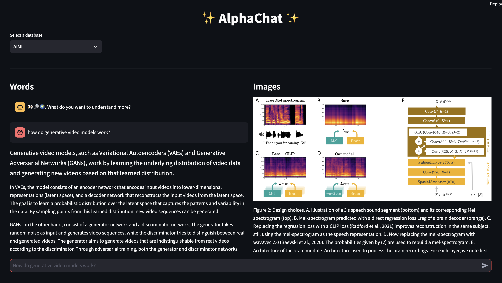

# alphachat 

Visual retrieval of diagrams 

### Run 

### Add data
- run `python -m src.start.init_load_urls`
- we run the scripts as a python module so it loads correctly 

### Notes

- Image extraction MVP: Uses https://ar5iv.labs.arxiv.org/ to scrape images. Sources upto the end of December 2023. Not a live preview service. Would like to scrape more images eventually.
